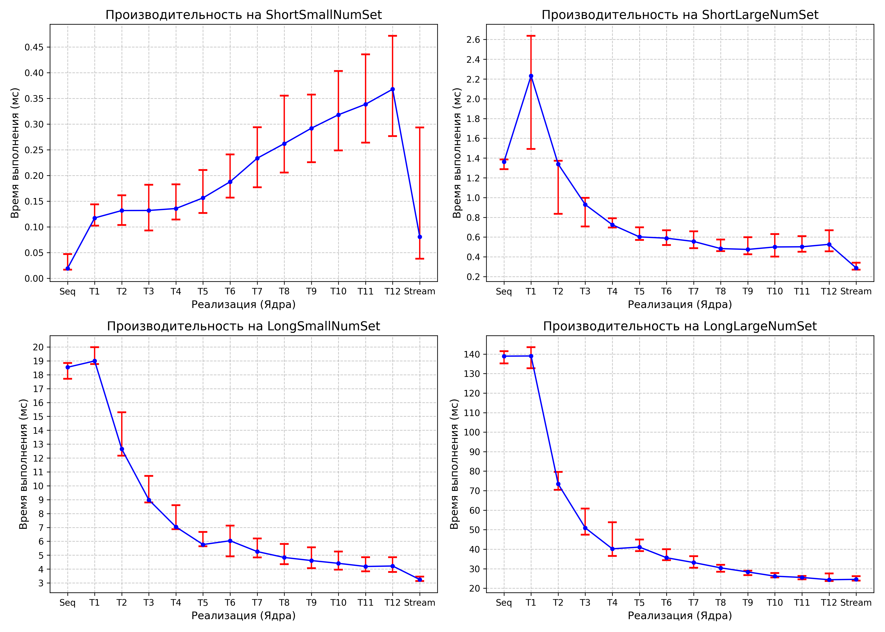
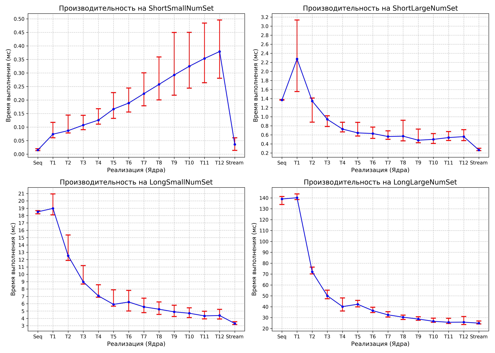

#### Задача
В данной задаче реализованы 3 алгоритма 
поиска составного числа в массиве простых чисел.

Алгоритм получает на вход массив чисел и выдает
в качестве резальтата true - если составное число
найдено, иначе false 

(а) seq    - 1 поток
(б) thread - 1-12 потоков с помощью java.lang.Thread
(в) stream - использование ParallelStream

#### Исследование скорости поиска
Проведено исследование скорости работы этих алгоритмов. 
Для этого были сгенерированы 4 набора чисел:
1. short-small - массив длины 500 состоящий из чисел 
в диапазоне от 0 до 5000
2. short-large - массив длины 500 состоящий из чисел
   размера около 10 000 000
3. long-small - массив длины 50 000 состоящий из чисел
   в диапазоне от 0 до 700 000
4. long-large - массив длины 50 000 состоящий из чисел
   размера около 10 000 000

#### Исследование
Произведено измерение скорости работы каждого алгоритма 
на каждом наборе данных. Для этого мы запустили алгоритм 
N раз и вычислили среднее время работы алгоритма `avg` 
и 80% доверительный интервал `[tmin,tmax]`. N было подобрано так,
настолько большим, чтобы среднее и доверительный интервал
были корректными.

Результаты исследвания скорости работы алгоритмов предсталены 
на следующем рисунке.
  **100 запусков**
 **1000 запусков**
По оси Y отложено время выполнения в миллисекундах.
По оси X - алгоритм последовательный, 
паралельный с указанием количества потоков и parallel stream.
Указано среднее значение и 80% доверительный интервал
(то есть 80% запусков по времени попало в данный интервал)
