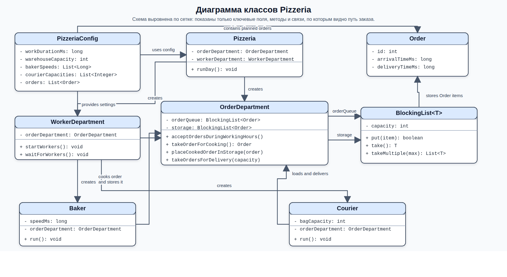

# Pizzeria Simulation

Симулятор рабочего дня пиццерии на Java. Проект моделирует поток заказов, работу пекарей, ограниченный склад готовых заказов и доставку курьерами.

## Что делает проект

- принимает заказы по расписанию в течение рабочего дня;
- распределяет их между пекарями;
- складывает готовые заказы в ограниченное хранилище;
- отдает готовые заказы курьерам партиями;
- завершает работу после обработки очереди заказов и опустошения склада.

Основная идея модели: пекари и курьеры работают параллельно, а обмен между ними идет через потокобезопасные блокирующие очереди.

## Классы на диаграмме

- `Pizzeria` запускает симуляцию рабочего дня и связывает две основные подсистемы: прием заказов и управление работниками.
- `PizzeriaConfig` хранит параметры дня: длительность работы, размер склада, скорости пекарей, вместимость сумок курьеров и список заказов.
- `WorkerDepartment` создает и завершает потоки пекарей и курьеров, используя настройки из конфигурации.
- `OrderDepartment` управляет жизненным циклом заказа: принимает заказ, передает его пекарю, помещает готовую пиццу на склад и выдает ее курьеру.
- `Baker` берет заказ из очереди, готовит его и кладет в хранилище готовых заказов.
- `Courier` забирает готовые заказы со склада партиями и завершает их доставку.
- `BlockingList<T>` — потокобезопасная блокирующая структура с ограниченной вместимостью; через нее синхронизируются потоки.
- `Order` описывает один заказ: его идентификатор, время появления и длительность доставки.

## Взаимосвязи классов

- `Pizzeria` создается на основе `PizzeriaConfig`, затем поднимает `OrderDepartment` и `WorkerDepartment`.
- `WorkerDepartment` использует `PizzeriaConfig`, чтобы запустить нужное количество `Baker` и `Courier`.
- Все рабочие взаимодействуют не напрямую, а через общий `OrderDepartment`.
- Внутри `OrderDepartment` есть две `BlockingList<Order>`: очередь новых заказов и склад готовых заказов.
- `Baker` переносит заказ из очереди на склад, а `Courier` забирает его со склада и доводит до состояния `DELIVERED`.
- `PizzeriaConfig` содержит список `Order`, из которого формируется поток входящих заказов в течение рабочего дня.

*Рис. 1. На диаграмме показаны те же классы, что кратко описаны в разделах выше: `Pizzeria` собирает симуляцию, `PizzeriaConfig` задает параметры дня, `OrderDepartment` проводит `Order` через очередь и склад, `Baker` и `Courier` работают через него, а `BlockingList<Order>` связывает потоки между собой.*

`PizzeriaConfigParser` не включен в диаграмму специально: он только читает JSON-конфигурацию и не участвует в основном потоке обработки заказа.
